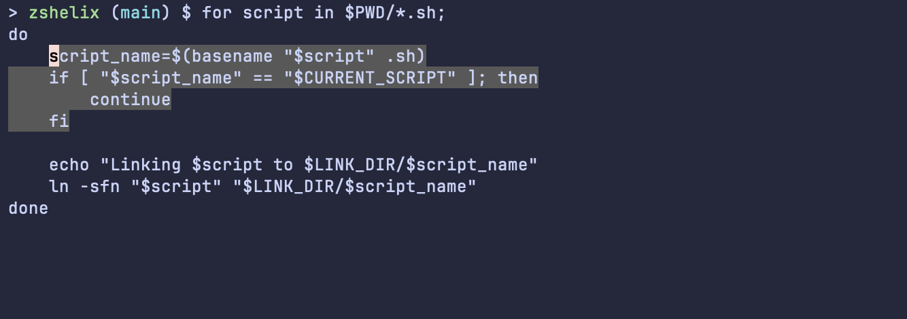

# zshelix

This plugin provides a (currently minimal) set of Helix keybindings for Zsh.




## Installation

### Manual Installation

1. Clone this repository (replace `$HOME/zshelix` with a different directory if preferred):
   ```sh
   git clone https://github.com/thomasschafer/zshelix.git $HOME/zshelix
   ```

1. Source `zshelix.plugin.zsh` in your `.zshrc` file:
   ```sh
   source $HOME/zshelix/zshelix.plugin.zsh
   ```

### Using a Plugin Manager

TODO


## Configuration

Ensure that any configuration happens before the plugin is initialised, i.e. that any configuration lines are above the line in your `.zshrc` in which you `source` the plugin.

### Cursor styles

To configure the cursor styles in each mode you can override the following three values (updating the string values as required):

```
ZHM_CURSOR_NORMAL=$'\e[2 q\e]12;#b8c0e0\a'
ZHM_CURSOR_INSERT=$'\e[2 q\e]12;#f4dbd6\a'
ZHM_CURSOR_SELECT=$'\e[2 q\e]12;#f5a97f\a'
```

You can also use `$ZHM_CURSOR_BLOCK`, `$ZHM_CURSOR_BEAM` and `$ZHM_CURSOR_BAR` as values for block, beam and bar cursors respectively.


## Keybindings

### Normal Mode

| Key | Description | Function |
|-----|-------------|----------|
| `h` | Move left | `move_char_left` |
| `j` | Move down (or forward through history) | `move_visual_line_down` |
| `k` | Move up (or back through history) | `move_visual_line_up` |
| `l` | Move right | `move_char_right` |
| `w` | Move next word start | `move_next_word_start` |
| `W` | Move next WORD start | `move_next_long_word_start` |
| `b` | Move previous word start | `move_prev_word_start` |
| `B` | Move previous WORD start | `move_prev_long_word_start` |
| `e` | Move next word end | `move_next_word_end` |
| `E` | Move next WORD end | `move_next_long_word_end` |
| `r` | Replace with a character | `replace` |
| `R` | Replace with yanked text | `replace_with_yanked` |
| `c` | Change selection (delete and enter insert mode) | `change_selection` |
| `d` | Delete selection | `delete_selection` |
| `i` | Insert before selection | `insert_mode` |
| `I` | Insert at the start of the line | `insert_at_line_start` |
| `a` | Insert after selection (append) | `append_mode` |
| `A` | Insert at the end of the line | `insert_at_line_end` |
| `u` | Undo change | `undo` |
| `U` | Redo change | `redo` |
| `y` | Yank selection | `yank` |
| `p` | Paste after selection | `paste_after` |
| `P` | Paste before selection | `paste_before` |
| `x` | Select current line, if already selected, extend to next line | `extend_line_below` |
| `X` | Select current line, if already selected, extend to previous line | `extend_line_above` |
| `;` | Collapse selection onto a single cursor | `collapse_selection` |
| `Alt-;` | Flip selection cursor and anchor | `flip_selections` |
| `%` | Select entire file | `select_all` |
| `v` | Enter select (extend) mode | `select_mode` |
| `Esc` | Switch to normal mode | `normal_mode` |
| `gh` | Go to the start of the line | `goto_line_start` |
| `gl` | Go to the end of the line | `goto_line_end` |
| `gs` | Go to first non-whitespace character of the line | `goto_first_nonwhitespace` |
| `gg` | Go start of file | `goto_file_start` |
| `ge` | Go to the end of the file | `goto_last_line` |
| `Enter` | Run the command in the buffer | `accept_line` |
| `Ctrl-l` | clear the current buffer | `clear-screen` |
| `Ctrl-p` | Move up (or back through history) | `move_visual_line_up` |
| `Ctrl-n` | Move down (or forward through history) | `move_visual_line_down` |

### Insert Mode

| Key | Description | Function |
|-----|-------------|----------|
| `Esc` | Switch to normal mode | `normal_mode` |
| `Alt-b` | Move previous word start | `move_prev_word_start` |
| `Alt-f` | Move next word start | `move_next_word_start` |
| `Left` | Backward a char | `backward-char` |
| `Right` | Forward a char | `forward-char` |
| `Home` | Move to line start | `goto_line_start` |
| `End` | Move to line end | `goto_line_end` |
| `Alt-d` | Delete next word | `delete-word` |
| `Delete` | Delete next char | `delete-char` |
| `Alt-Backspace` | Delete previous word | `backward-kill-word` |
| `Alt-Delete` | Delete next word | `delete-word` |
| `Backspace` | Delete previous char | `backward-delete-char` |
| `Enter` | Run the command in the buffer | `accept_line` |
| `Ctrl-r` | Search history backward | `history-incremental-search-backward` |
| `Ctrl-s` | Search history forward | `history-incremental-search-forward` |
| `Ctrl-p` | Move up (or back through history) | `move_visual_line_up` |
| `Ctrl-n` | Move down (or forward through history) | `move_visual_line_down` |


## Similar projects

[zsh-helix-mode](https://github.com/Multirious/zsh-helix-mode) also provides Helix keybindings for Zsh, and (at the time of writing) has many more features.
